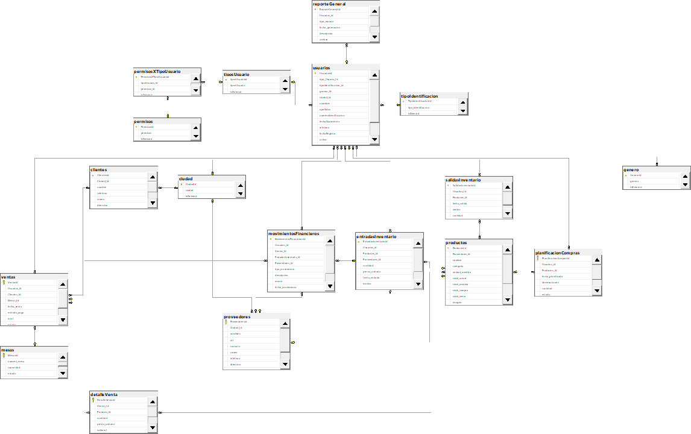
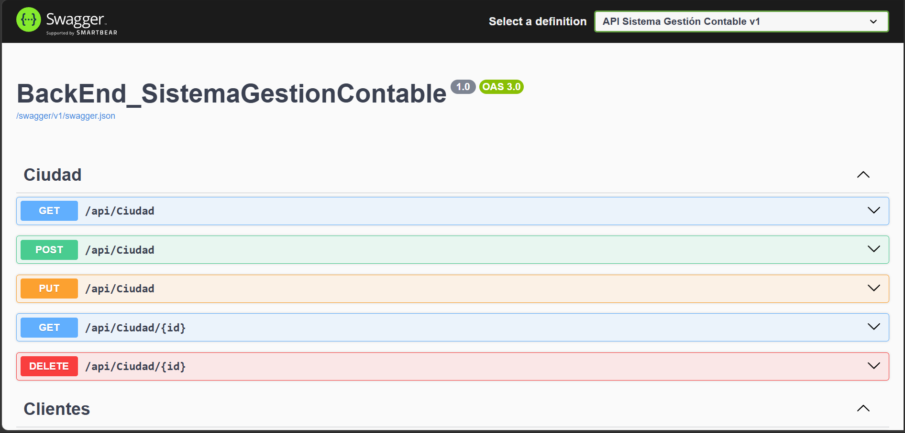

# Accounting Management System

Accounting Management System is a backend solution designed to support accounting and financial management processes through a scalable REST API architecture.

The project was developed using ASP.NET Core and SQL Server, following software engineering best practices and a layered architecture to ensure maintainability, scalability and code organization.

---

## Features

* Accounting data management
* REST API architecture
* Layered application design
* Database integration
* Business logic implementation
* Scalable backend structure

---

## Technologies Used

### Backend

* ASP.NET Core
* C#
* Entity Framework Core

### Database

* SQL Server

### Cloud Deployment

* Microsoft Azure

### Version Control

* Git
* GitHub

---

## Architecture

The project follows a layered architecture composed of:

* Controllers
* DTOs
* Models
* Repository Pattern
* Services

This structure improves maintainability, separation of concerns and scalability.

---

## My Contributions

* Backend development
* REST API implementation
* Business logic development
* Database integration
* Entity Framework migrations
* API deployment on Microsoft Azure

---

## Deployment

The application was previously deployed on Microsoft Azure for testing and publication purposes.

---

## Screenshots

### Database Diagram
Entity Relationship Diagram (ERD) of the Accounting Management System database, illustrating tables, attributes, and relationships that support the application's core functionality.



---

### API Documentation - Swagger
Interactive API documentation generated with Swagger, providing detailed information about available endpoints, request parameters, and response structures for the Accounting Management System.



---

## Repository Structure

```bash
backend/
database/
docs/
README.md
```

---

## Author

Kevin Alexander Tibaquicha Ortiz
Engineering Systems and Computing Student
